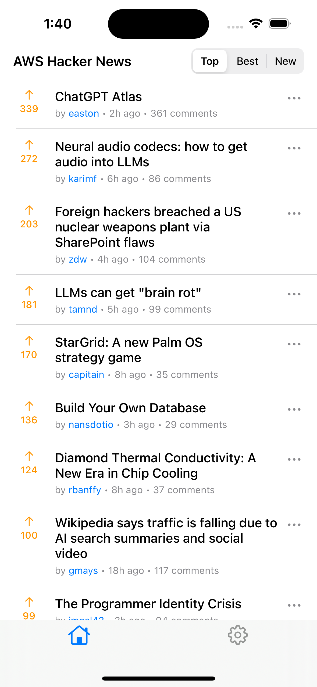
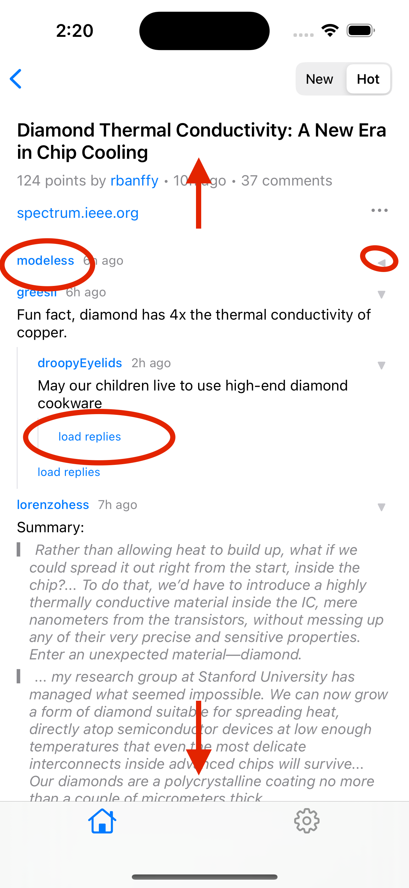
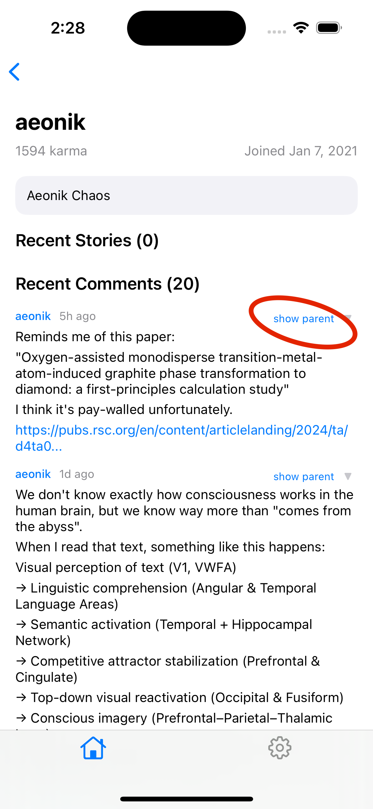
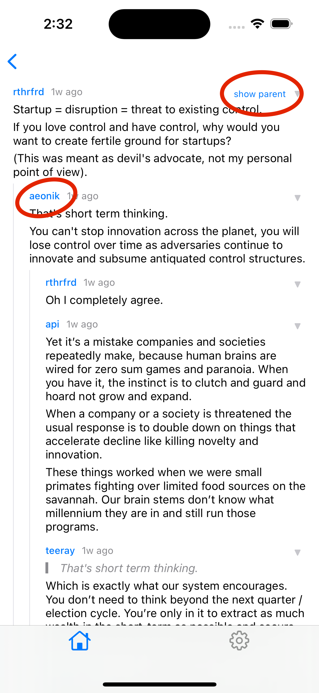
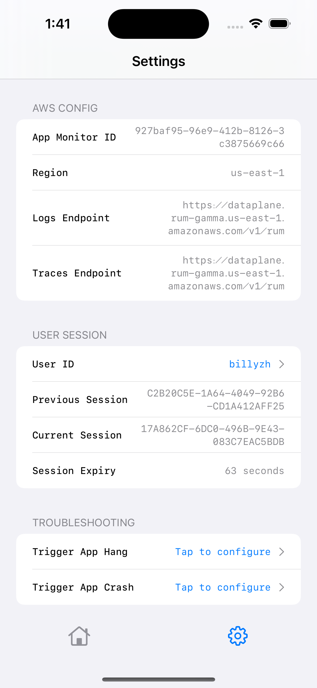
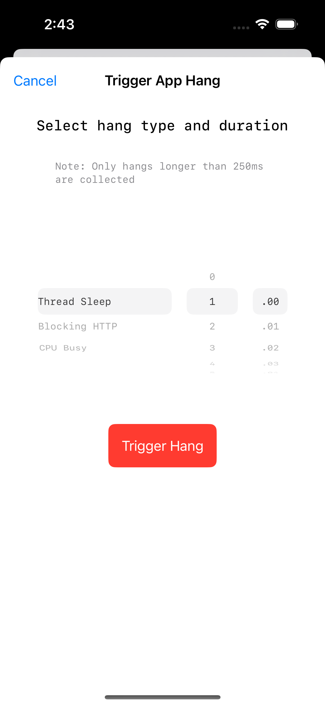
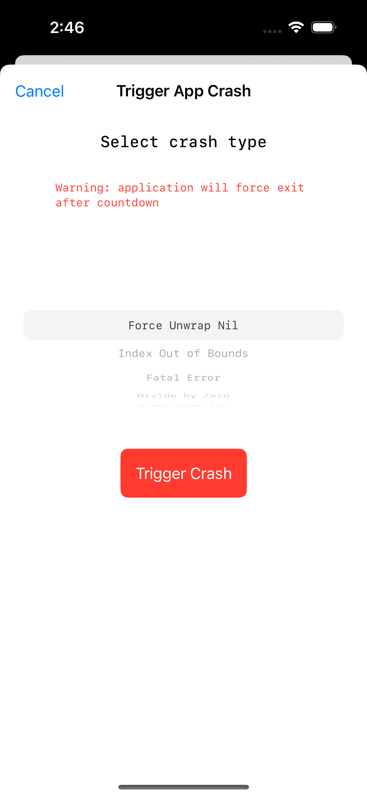
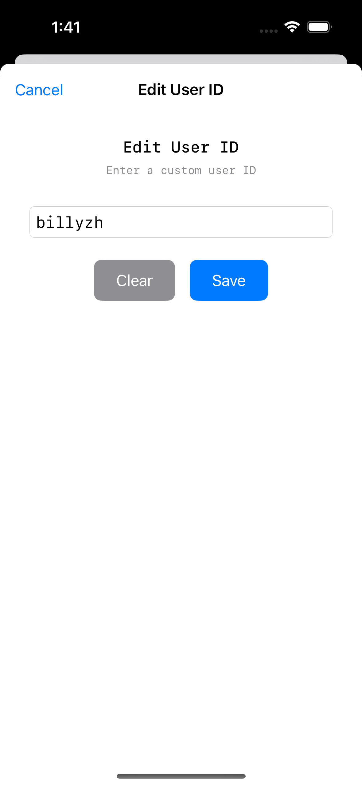

# AWS Hacker News Demo

Special thanks to maintainers of the HackerNews API! Checkout their work https://github.com/HackerNews/API

## Getting Started

1. The `Home` tab is built entirely with UIKit, and each post/comment involved triggers a separate HTTP request.
2. And the `Settings` tab is built with SwiftUI! Both view types are tracked.

## HackerNewsViewController

<table>
<tr>
<td width="600px" style="vertical-align: top;">

**HackerNewsViewController** - this is the root home tab controller responsible for showing the list of stories. \*\*\*This is currently missing due to our decision to asynchronously invoke the expensive UIKit swizzling logic, which cut down blocking initialization time by 90%. If there is a way to bring this back into scope, then we will do so during performance testing.

**Actions:**

1. Scroll up to refresh
2. Scroll down to infinite scroll
3. Click on "top", "best", or "new" to switch the ranking algorithm
4. Click on "three dots" icon to share the story link
5. Click on story title to navigate to see the full discussion thread
6. Click on username to navigate to a user view

</td>
<td width="300px" style="vertical-align: top;">

</td>
</tr>
</table>

## CommentsViewController

<table>
<tr>
<td width="600px" style="vertical-align: top;">

**CommentsViewController** - this view is responsible for showing the full comment thread for a particular story in hierarchical and collapsible tree-format.

**Actions:**

1. Scroll up to refresh
2. Scroll down to infinite scroll
3. Click on "new" or "hot" to change the ranking algorithm.
4. Click on load replies to fetch more replies, which will trigger additional HTTP requests
5. Click on the arrow on the top right corner of each post to collapse an individual comment thread
6. Click on username to navigate to UserView
7. Click on the link to open the article in a browser

</td>
<td width="300px" style="vertical-align: top;">

</td>
</tr>
</table>

## UserViewController

<table>
<tr>
<td width="600px" style="vertical-align: top;">

**UserViewController** - this view is responsible for showing details about a particular user, in addition to any recent stories or comments that they have posted.

**Actions:**

1. The comments and story components are re-used from the other views described earlier
2. Click on show parent to see more context regarding an individual comment, and will navigate you to ParentCommentViewController. If the parent comment is a story instead of another comment, then you will instead be redirected to CommentsViewController.

</td>
<td width="300px" style="vertical-align: top;">

</td>
</tr>
</table>

## ParentCommentViewController

<table>
<tr>
<td width="600px" style="vertical-align: top;">

**ParentCommentViewController** - this view is responsible for showing more context about a particular comment, and is only accessible via UserViewController.

**Actions:**

1. The same actions regarding show parent and username apply
2. To navigate backwards, either click on the back button on the top left or swipe left.
3. To clear the navigation stack, click on the home button

</td>
<td width="300px" style="vertical-align: top;">

</td>
</tr>
</table>

## Settings Tab

The Settings tab is primarily made with SwiftUI, though the root controller is made with UIKit.

### SettingsHostingController

<table>
<tr>
<td width="600px" style="vertical-align: top;">

**SettingsHostingController** - this the root view responsible for the Settings tab, and will recorded as a UIKit view

**Actions:**

1. Click on userId to set a user ID
2. Click on Tap to configure for "Trigger App Hang" to open hang modal
3. Click on Tap to configure for "Trigger App Crash" to open crash picker

</td>
<td width="300px" style="vertical-align: top;">

</td>
</tr>
</table>

### HangPickerView

<table>
<tr>
<td width="600px" style="vertical-align: top;">

**HangPickerView** - this SwiftUI view is responsible for configuring app hangs. Please note that based on Apple recommendation, only app hangs longer than 250 ms are reported.

</td>
<td width="300px" style="vertical-align: top;">

</td>
</tr>
</table>

### CrashPickerView

<table>
<tr>
<td width="600px" style="vertical-align: top;">

**CrashPickerView** - this SwiftUI view allows you to cause crashes of various types e.g. force unwrap, index out of bounds, etc. Note that these crash types are sorted by frequency of occurrence in the real world.

</td>
<td width="300px" style="vertical-align: top;">

</td>
</tr>
</table>

### UserIdEditorView

<table>
<tr>
<td width="600px" style="vertical-align: top;">

**UserIdEditorView** - You can edit your userId using this modal. Please keep in mind that if you manually set this user ID in production, then you could be storing personally identifiable information (PII) so it is recommended to hash these values.

</td>
<td width="300px" style="vertical-align: top;">

</td>
</tr>
</table>