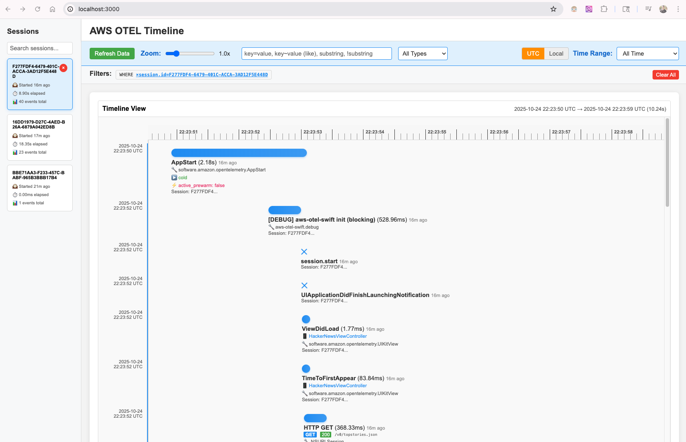

# AWS OTel UI

We made this easy timeline viewer to help with development and debugging. Feel free to use it!

There are three routes supported

- To view the UI, visit http://localhost:3000/ in your browser
- Logs endpoint: http://localhost:3000/v1/logs
- Traces endpoint: http://localhost:3000/v1/traces
- Metrics endpoint: coming soon!

## Getting Started

```
npm install
npm start
```

Then visit http://localhost:3000!

## Screenshot


