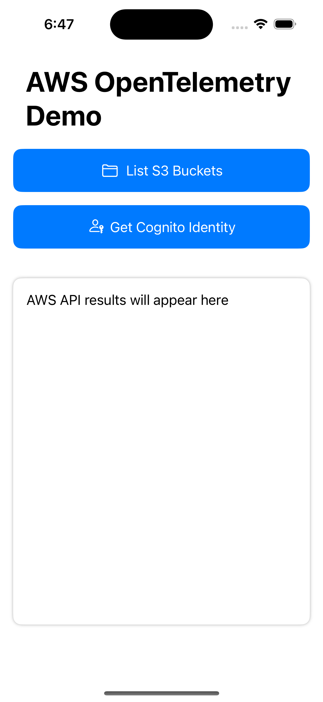

# AWS OpenTelemetry Swift - Simple AWS Demo (SwiftUI)

This is a simple iOS demo application that demonstrates how to use the AWS OpenTelemetry Swift library to instrument your iOS application and send telemetry data to AWS services. This version uses SwiftUI for the user interface.



## Features

- Integration with AWS OpenTelemetry Swift SDK
- AWS S3 bucket listing
- AWS Cognito identity retrieval
- Automatic tracing of AWS API calls

## Infrastructure Setup

This demo includes a CDK project that creates all the necessary AWS infrastructure:

1. Navigate to the CDK directory:
    ```
    cd cdk
    ```

2. Deploy infrastructure using the script provided:
    ```
    ./demo-cdk.sh deploy
    ```

3. Note the outputs from the deployment, which you'll need to update in your Android app:
   - IdentityPoolId
   - AppMonitorId
   - Region

For more details, see the [CDK README](./cdk/README-CDK.md).

## Setup

1. Install the AWS SDK for Swift using Swift Package Manager:
   - In Xcode, go to File > Add Packages...
   - Enter the URL: `https://github.com/awslabs/aws-sdk-swift`
   - Add the following Package Products to your application's target:
     - `AWSClientRuntime`
     - `AWSCognitoIdentity`
     - `AWSS3`
2. Follow the instructions in this repository's main `README.md` to install the ADOT Swift SDK
3. Follow the instructions in the above section to deploy the CDK infrastructure
4. Update AWS credentials in `SimpleAwsDemoApp.swift`:
    ```swift
    private let cognitoPoolId = "YOUR_IDENTITY_POOL_ID_FROM_OUTPUT"
    private let awsRegion = "YOUR_REGION_FROM_OUTPUT"
    ```
5. Update OpenTelemetry configuration in `SimpleAwsDemoApp.swift`:
    ```swift
    let config = AwsOpenTelemetryConfig(
        rum: RumConfig(
            region: "YOUR_REGION_FROM_OUTPUT",
            appMonitorId: "YOUR_APP_MONITOR_ID_FROM_OUTPUT",
            overrideEndpoint: EndpointOverrides(
                logs: "http://localhost:4318/v1/logs",
                traces: "http://localhost:4318/v1/traces"
            ),
            debug: true
        ),
        application: ApplicationConfig(applicationVersion: "1.0.0")
    )
    ```
   Note: Remove the overrideEndpoint section when you want to use AWS services directly instead of the local collector.
6. Follow the instructions in the `README.md` in Examples/ to setup the local OpenTelemetry Collector

## How It Works

1. The application initializes the AWS OpenTelemetry Agent in the `SimpleAwsDemoApp` class.
2. When you click on the "List S3 Buckets" button, the app makes an AWS S3 API call to list your buckets.
3. When you click on the "Get Cognito Identity" button, the app retrieves your Cognito identity ID.
