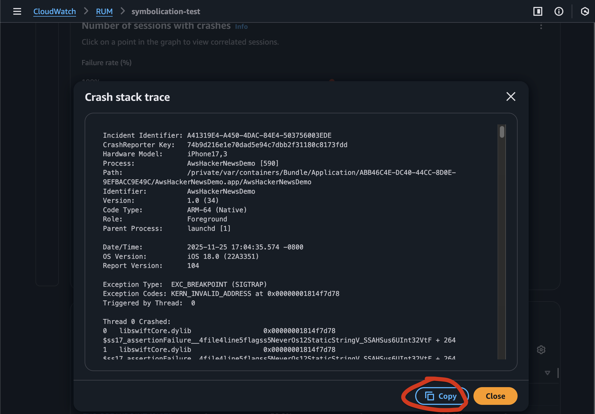
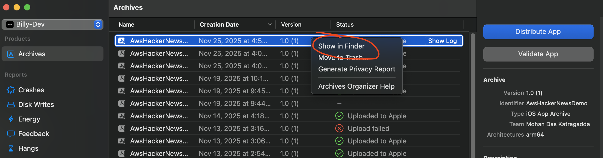
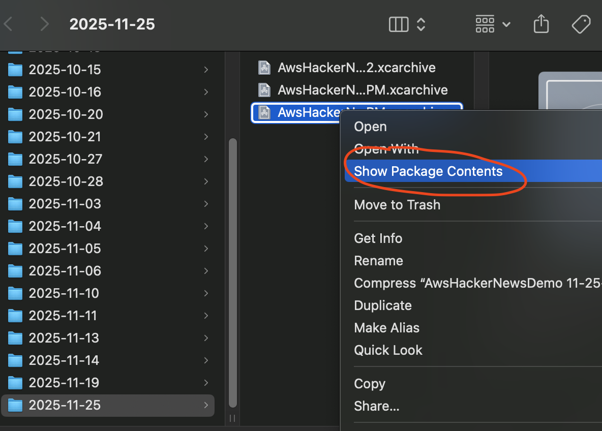
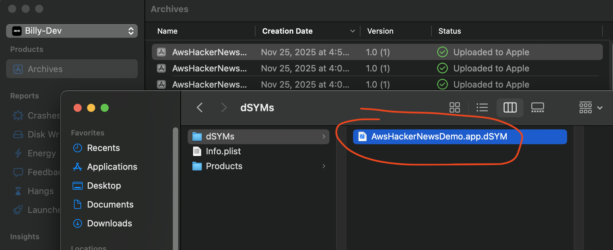

# iOS Crash Report Symbolication

> If on-device symbolication is not possible for your application, then here is an example on how to symbolicate your crash reports offline:

We've provided `symbolicate_crash.sh` using the [Apple recommended `atos` CLI tool packaged with XCode](https://developer.apple.com/documentation/xcode/adding-identifiable-symbol-names-to-a-crash-report/#Symbolicate-the-crash-report-with-the-command-line). You must provide your own dSYM files, which will convert memory addresses associated with your application into human readable function names and line numbers. For native Swift modules that are not a part of your application, we will also manually run `swift-demangle` line-by-line if the module indeed exists in the Swift runtime.

## Getting Started

### Expected Directory Structure

```
Symbolication/
├── symbolicate_crash.sh
├── MyCrash.crash               # Your crash report
└── MyApp.app.dSYM/             # Your dSYM bundle
    └── Contents/
        └── Resources/
            └── DWARF/
                └── MyApp
```

1. **Add crash report** - Lookup the crash report captured by AWS RUM, and copy it into this directory as `MyCrash.crash`. See [example.crash](example.crash) for reference.

| Step                | Action                                             |
| ------------------- | -------------------------------------------------- |
| 1. Copy Stack Trace |  |

2. **Add dSYM file** - Drag the corresponding `MyApp.app.dSYM` bundle here from:
   - `~/Library/Developer/Xcode/Archives/[date]/[AppName].xcarchive/dSYMs/`
   - Xcode → Window → Organizer → Archives → Show in Finder → Show Package Contents → dSYMs

| Step                     | Action                                                |
| ------------------------ | ----------------------------------------------------- |
| 1. Show in Finder        |         |
| 2. Show Package Contents |  |
| 3. Find dSYM             |              |

3. **Run script** - The script automatically verifies UID match between crash report and dSYM, then creates symbolicated crash `MyCrash.symbolicated.crash`. See [example.symbolicated.crash](example.symbolicated.crash) for reference.

```bash
# following format
# bash symbolicate_crash.sh --crash <file> --dsym <file> [--arch <arch>]

bash symbolicate_crash.sh --crash example.crash --dsym AwsHackerNewsDemo

✅ UID match: dc3e6160b01230418d603e9b58bda5f6
Symbolicating example.crash with AwsHackerNewsDemo (arch: arm64, load: 0x104360000)
Symbolicated 9 addresses
Demangled 1 Swift symbols
Symbolicated crash report saved to: example.symbolicated.crash

Summary:
- Processed crash report: example.crash
- Used dSYM: AwsHackerNewsDemo
- Architecture: arm64
- Binary load address: 0x104360000
- Symbolicated addresses: 9
- Demangled Swift symbols: 1

Next steps:
- Review symbolicated crash report for readable function names
- Focus on frames from your app (AwsHackerNewsDemo)
- System library frames (UIKit, Foundation) cannot be symbolicated
```

4. **[Optional] Verify dSYM UID matches crash report** - The script already verifies the UIDs for you.

- ✅ **UID match** - Correct dSYM, symbolication will work
- ⚠️ **UID mismatch** - Wrong dSYM, may produce incorrect symbols
- ℹ️ **Could not verify** - UID extraction failed, check file formats

If the UIDs do not match, then this is how you manually compare the UIDs:

```bash
# Check crash report UID (in Binary Images section)
grep "AwsHackerNewsDemo.*<.*>" example.crash
# Output: 0x104360000 - 0x1046fffff AwsHackerNewsDemo arm64 <dc3e6160b01230418d603e9b58bda5f6>
#         ↑ Load address range    ↑ App name    ↑ Arch  ↑ UID (must match dSYM)

# Check dSYM UID (if you have the binary file directly)
dwarfdump --uid AwsHackerNewsDemo
# Output: UID: DC3E6160-B012-3041-8D60-3E9B58BDA5F6 (arm64) AwsHackerNewsDemo
#         ↑ Same UID as crash report (formatted with dashes)

# OR if you have a dSYM bundle:
dwarfdump --uid MyApp.app.dSYM/Contents/Resources/DWARF/MyApp
```

**What to verify:**

- UIDs match (ignoring dashes and case): `dc3e6160b01230418d603e9b58bda5f6` = `DC3E6160-B012-3041-8D60-3E9B58BDA5F6` ✅
- Architecture matches: `arm64` (device) vs `x86_64` (simulator)
- App name matches: `AwsHackerNewsDemo`

## Usage

| Flag          | Required | Default | Description                                                                                                                                        | Example                     |
| ------------- | -------- | ------- | -------------------------------------------------------------------------------------------------------------------------------------------------- | --------------------------- |
| `-c, --crash` | Yes      | -       | Path to .crash file                                                                                                                                | `report.crash`              |
| `-d, --dsym`  | Yes      | -       | dSYM file or binary name<br>• Full path: Uses provided path directly<br>• Binary name: Looks for `./MyApp.app.dSYM/Contents/Resources/DWARF/MyApp` | `MyApp.app.dSYM` or `MyApp` |
| `-a, --arch`  | No       | `arm64` | Target architecture                                                                                                                                | `arm64`, `x86_64`           |
| `-h, --help`  | No       | -       | Show help message                                                                                                                                  | -                           |

### Output

Creates `<crash_report>.symbolicated.crash` with function names and line numbers added to memory addresses.
